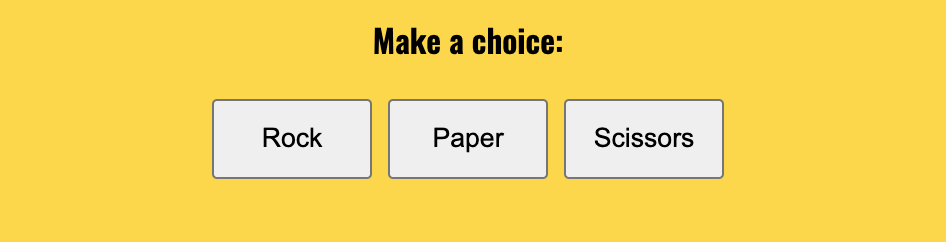
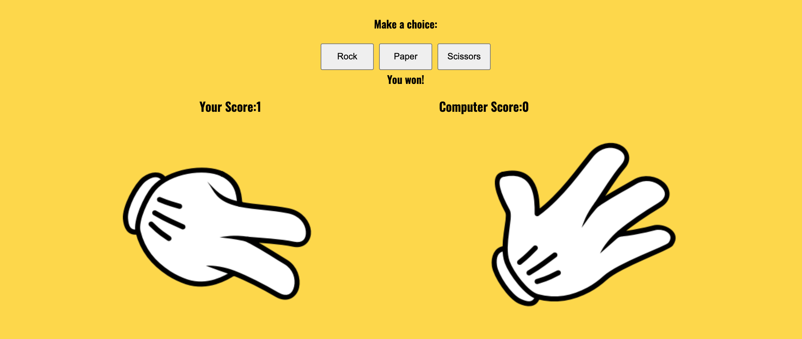
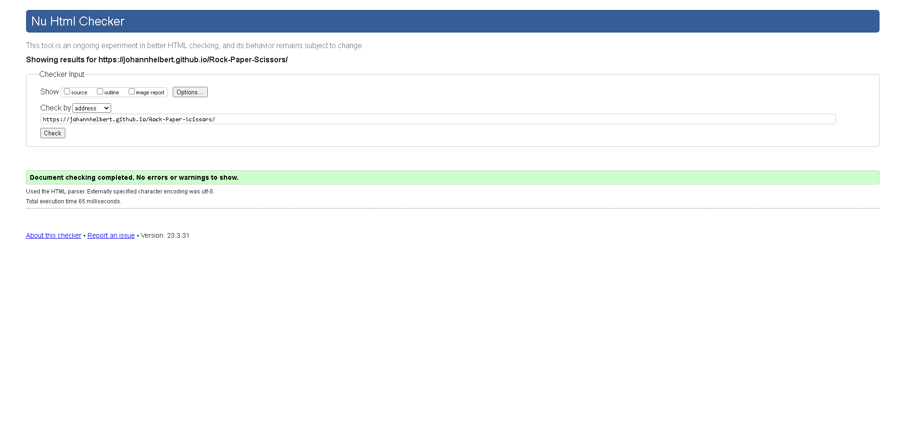
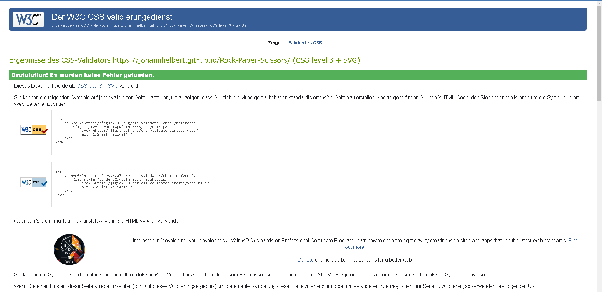
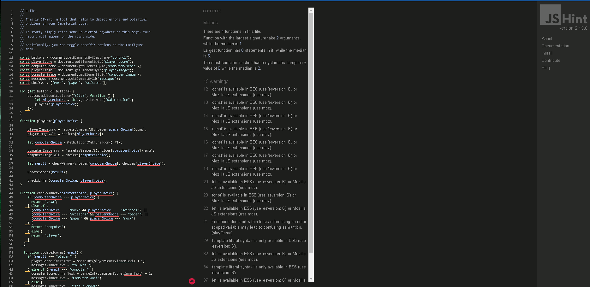
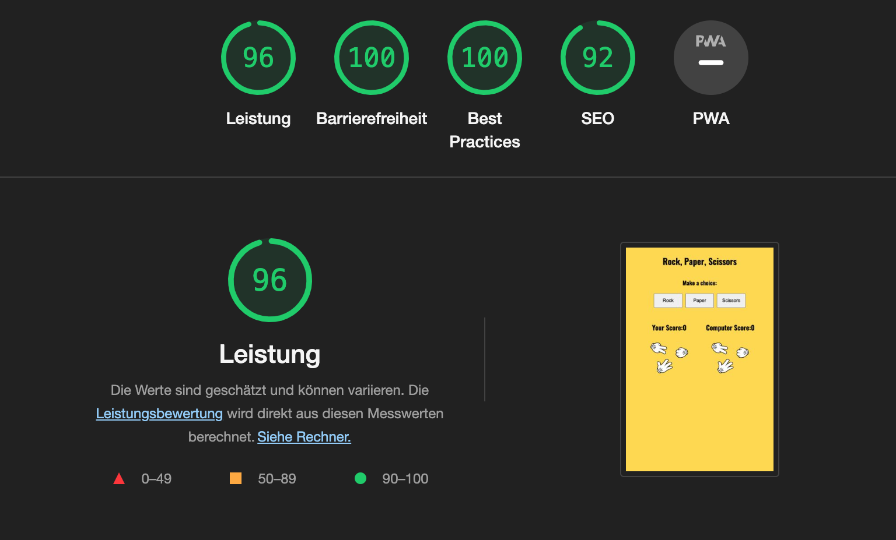

# **Rock Paper Scissors**

#### Rock paper scissors (also known by other orderings of the three items, with "rock" sometimes being called "stone," or as Rochambeau, roshambo, or ro-sham-bo) is an intransitive hand game, usually played between two people, in which each player simultaneously forms one of three shapes with an outstretched hand. These shapes are "rock" (a closed fist), "paper" (a flat hand), and "scissors" (a fist with the index finger and middle finger extended, forming a V).

 

 

 

## User Experience (UX)

 

### Initial Discussion

 

Users of this game will learn the rules of Rock Paper Scissors so they can apply it to decison making with others in their lives. This site will be
targeted towards adults and children alike as a simple app to learn, practice and have fun with.

 

### User Stories

 

#### Client Goals

 

* To be able to view the site on a range of device sizes.
* To make it easy for potential viewers to find out what the Rock Paper Scissors Game is and how to play it.
* To allow people to have fun and play the Game.

 

#### First Time Visitor Goals

 

* I want to find out what is Rock Paper Scissors and how to play the Game.
* I want to be able to navigate the site easily to find information.
* I want to be able to find the scores , who is the Winner, the rules how to play.

 

#### Returning Visitor Goals

 

* I want to find fun every time when if I visit this Site.
* I want to be able to easily understand the rules and play the Game.

 

#### Frequent Visitor Goals

 

* I want to be able to have fun every time if I visit this site.

 

- - -

 

## Design

### Colour Scheme

Colors were used :   #fed83a, #fff, #000

The website use  colors that are often used in the Rock Paper Scissors site. The colors were created using the colors palette from css.

### Typography

Google Fonts was used for the following fonts:

* oswald were used for the site. It is a serif font. 

### Imagery

The Game images were used from https://freesvg.org.

### Wireframes

Wireframes were not used,

 

# Features

 

## Existing Features

 

## Header

 

* Featured on the top of the page, the header shows the game name: Rock Paper Scissors in a font that is playful and clearly contrasts with the background.

 

* This header tells the visitors what game they are playing.

 

 

#### The Game Options

 

* The Game include a instruction and a choice of options like Rock, Papper or Scissors to choose from to play.
* This section provides interactive buttons that the user can click to make their choice.
* How to play this Game : in the bottom of the site is a instruction

 

## The Game Results

 

- When the user clicks an option, the image relating to their choice is shown on their side of the game board.
- The JavaScript code chooses a random option for the Computer player, displays the image relating to the computer's choice, and then
  determines who is the winner.
- The winner is announced to the user under the options button, and the score is updated for either the user or the computer,
  depending on who won.
- The results and score are clear to the user, making the game easy to play, understand who won, and what the score is.

 

 

## The Footer
 

- The footer section includes the rules of Rock Paper Scissors.
 

- The footer is valuable to the user because it clearly explains how the game is played.
 

 

### Features Left to Implement
- When there is time, i would include alert message or a timer when the game is over, or a max score.

 

### Accessibility

I have been mindful during coding to ensure that the website is as accessible friendly as possible. I have achieved this by:

* Using semantic HTML.
* Using descriptive alt attributes on images on the site.
* Ensuring that there is a sufficient colour contrast throughout the site.
* Ensuring buttons are working, and the scores working well aswell.

 

## Technologies Used

### Languages Used

HTML and CSS were used to create this website.

### Frameworks, Libraries & Programs Used

codeanywhere - For version control.

Github - To save and store the files for the website.

Google Fonts - To import the fonts used on the website.

Google Dev Tools - To troubleshoot and test features, solve issues with responsiveness and styling.

[Am I Responsive?](http://ami.responsivedesign.is/) To show the website image on a range of devices.

 

## Deployment & Local Development

### Deployment

Github Pages was used to deploy the live website. The instructions to achieve this are below:

1. Log in (or sign up) to Github.
2. Find the repository for this project, Rock Paper Scissors.
3. Click on the Settings link.
4. Click on the Pages link in the left hand side navigation bar.
5. In the Source section, choose main from the drop down select branch menu. Select Root from the drop down select folder menu.
6. Click Save. Your live Github Pages site is now deployed at the URL shown.

### Local Development

#### How to Fork

To fork the Rock Paper Scissors repository:

1. Log in (or sign up) to Github.
2. Go to the repository for this project, JohannHelbert/Rock-Paper-Scissors.
3. Click the Fork button in the top right corner.

#### How to Clone

To clone the Rock Paper Scissors repository:

1. Log in (or sign up) to GitHub.
2. Go to the repository for this project, JohannHelbert/Rock-Paper-Scissors.
3. Click on the code button, select whether you would like to clone with HTTPS, SSH or GitHub CLI and copy the link shown.
4. Open the terminal in your code editor and change the current working directory to the location you want to use for the cloned directory.
5. Type 'git clone' into the terminal and then paste the link you copied in step 3. Press enter.

# Testing

### Full Testing

Full testing was performed on the following devices:

* Laptop:
  * Macbook Pro 2015 13 inch screen
* Mobile Devices:
  * iPhone 12 pro.
  * iPhone xr.
  * google pixel 5.

Each device tested the site using the following browsers:

* Google Chrome
* Safari
* Firefox

| Feature | Expected Outcome | Testing Performed | Result | Pass/Fail |
| --- | --- | --- | --- | --- |
| `Header` |
|  |  |  |  |  |
| Rock Paper Scissors Title | Is the title legible?. | Reading | legible. | Pass |
| `Footer` |
|  |  |  |  |  |
| Game Rules | Are the rules understandable?. | Reading  | understandable. | Pass |
| `Game Section` |
|   |   |   |   |
| Game function | The Game working well? | Click buttons | all functions working | Pass |
 

### Bugs/issues

 

- There was a space by the image links and a (1).
- Removing the space and (1) fixed the problem

## Solved bugs

- When I deployed my project to GitHub Pages I discovered my game was broken, the links to the other files (CSS,JS,images etc) did not work.
- I discovered this was because I had used absolute file paths.
- Removing the starting / fixed the problem.

## Validator Testing 

 

### HTML

 

- No errors were returned when passing through the official W3C validator

 

 

### CSS

 

- No errors were found when passing through the official (Jigsaw) validator

 

 

### Javascript

 

- Warnings were found but they not really errors and still pass

 

### Lighthouse

 

# Credits

 

## Content
 

- The text and Code were used from the Code Institute Portfolio Project Scope Video https://learn.codeinstitute.net/courses/course-v1:CodeInstitute+JSE_PAGPPF+2021_Q2/courseware/30137de05cd847d1a6b6d2c7338c4655/c3bd296fe9d643af86e76e830e1470dd/ for the footer , game section and header.
 

- The Javascript code for the function "Score", "The winner" how to do this was used from the example from this link https://www.w3schools.com/graphics/game_score.asp

- For the README.md i used the example from https://github.com/kera-cudmore/Bully-Book-Club/blob/main/docs/testing/w3c/w3cindex.png and https://github.com/kera-cudmore/BookWorm/blob/main/TESTING.md#BUGS and also the example from the project 2 Portfolio Project Scope Full Sample README.

 

## Media
 

- The pictures was taken from https://freesvg.org
 
